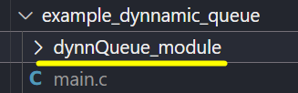

# QUEUE_MODULE

This project is a library (dynnQueue_module.c/h files) which helps to generate a basic dynamic queue wich can allocate different types of items.

The project purpose is to give an example or a base for a general queue where the user adds more type of elements at his convenience,
e. g., an structure array. 
 
## Example main.c code

The next code is an example of how the library can work:

```
#include "dynnQueue_module.h"

int main(int argc, char const *argv[])
{
   dynnQueue_t *myQueue = create_dynnQueue();
   
   qData_t item[6] = {{.data.i = 7, .type = T_INT}, {.data.c = 'Q', .type = T_CHAR}, \
   {.data.f = 10.7, .type = T_FLOAT}, {.data.u8 = 254, .type = T_U8T},\
   {.data.str = "hola", .type = T_STRING},  {.data.u16 = 1024, .type = T_U16T}};

   for(int i = 0; i < 6; i++)
      myQueue->put(myQueue, item[i]);
   
   for(int i = 0; i < 6; i++)
   {
      printf("Peek: " );
      myQueue->print(myQueue->peek(myQueue));

      printf("Dequeued: " );
      myQueue->print(myQueue->pop(myQueue));
   } 
   
   return 0;
}
```
1. Create a queue instance
   ```
   dynnQueue_t *myQueue = create_dynnQueue();
   ```

2. Create a variable of type qData_t and set values, for instance:
   ```
   qData_t item[6] = {{.data.i = 7, .type = T_INT}, {.data.c = 'Q', .type = T_CHAR}, \
   {.data.f = 10.7, .type = T_FLOAT}, {.data.u8 = 254, .type = T_U8T},\
   {.data.str = "hola", .type = T_STRING},  {.data.u16 = 1024, .type = T_U16T}};
   ```
3. Use the put method to enqueue elements
   ```
   myQueue->put(myQueue, item[i]);
   ```
4. Use pop method to extract the next element (you can create another qData_t variable to allocate the item data). On the other hand, you can use the function print method to print the value of that item
   ```
   qData_t next_item = myQueue->pop(myQueue);
   print_queue(next_item);
   ```
   or
   ```
   myQueue->print(myQueue->pop(myQueue));
   ```

5. Similarily, you can use the peek method even the pop method to see the next item on the queue 
   ```
   myQueue->print(myQueue->peek(myQueue));
   ```

**Example output:**
```
Peek: 7
Dequeued: 7
Peek: Q
Dequeued: Q
Peek: 10.70
Dequeued: 10.70
Peek: 254
Dequeued: 254
Peek: hola
Dequeued: hola
Peek: 1024
Dequeued: 1024
```

## Compilation
First you have to download the library (or you can clone or add to your project as a submodule). 
The library location in your workspace should look as follows:



Then, the next step for compilation it can be realized using the next gcc command on the terminal:

```
gcc -g main.c dynnQueue_module/dynnQueue_module.c -I dynnQueue_module -o main.exe
```

## Execution
To excecute the main.exe file you can use the next command:
```
.\main.exe
```

## Message
I hope you enjoy with this code, I know there are many ways to learn the concept of a queue but I hope this example helps you. Remember, a basic dynamic queue have three principal functions: 
1. create the queue
2. enqueue or put elements, 
3. dequeue or pop elements 
- and optional shows the queue peek.

And remember to use

👍"Hello Dog! 🐶"

Instead 

✖️"Hello World!"


